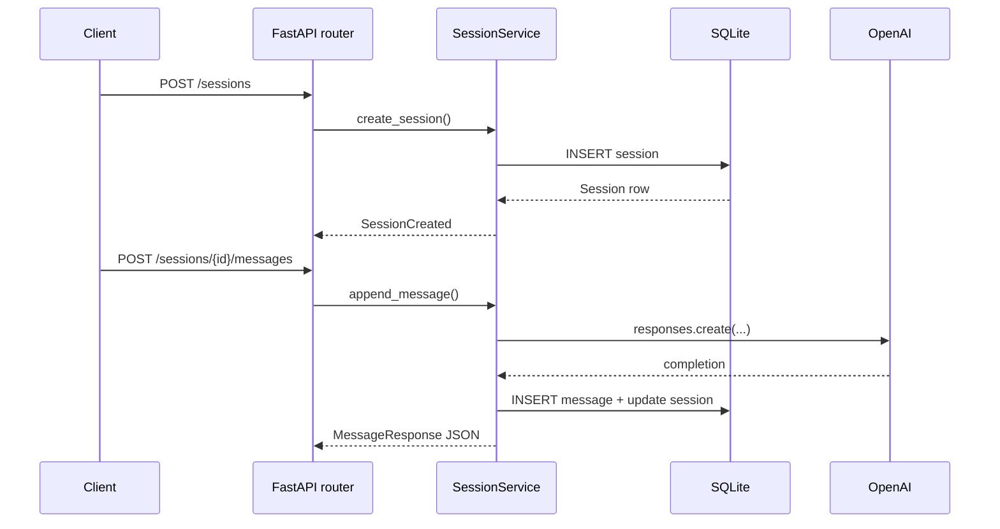

## Overview
This tutorial assembles a production-friendly FastAPI service that persists chat sessions in SQLite, calls the OpenAI Responses API with exponential backoff, and returns structured JSON payloads. By the end, you will have migrations, health checks, and a contract-tested API you can adapt to any provider.

## You’ll learn
- Model chat sessions and messages with SQLAlchemy, Alembic migrations, and SQLite.
- Implement FastAPI routers with Pydantic schemas and dependency-injected database sessions.
- Call the OpenAI Responses API asynchronously with retries, timeouts, and JSON schema validation.
- Expose REST endpoints for creating sessions, posting messages, and streaming summaries.
- Add automated tests, observability hooks, and deployment-ready settings.

## Prerequisites
- Python 3.11+, pipx (optional), and Git installed locally.
- An OpenAI API key with access to the Responses endpoint (set `OPENAI_API_KEY`).
- Basic FastAPI knowledge: dependency injection, routers, and async endpoints.
- Optional: Docker Desktop if you want to containerize the service after completion.

## Architecture at a glance



## Step 1 — Project bootstrap
1. Create a virtual environment and install dependencies:
   ```bash
   mkdir fastapi-ai-sessions && cd fastapi-ai-sessions
   python -m venv .venv
   source .venv/bin/activate  # Windows: .venv\Scripts\activate
   pip install --upgrade pip
   pip install fastapi uvicorn[standard] sqlalchemy aiosqlite alembic pydantic-settings httpx tenacity openai python-dotenv
   pip install -U typer rich
   pip install -U pytest pytest-asyncio httpx[http2]
   ```
2. Scaffold directories:
   ```bash
   mkdir -p app/api app/core app/db app/models app/schemas tests
   touch app/__init__.py app/api/__init__.py app/models/__init__.py app/schemas/__init__.py
   ```
3. Add a `.env` template for secrets:
   ```bash
   cat <<'ENV' > .env.example
   OPENAI_API_KEY="sk-your-key"
   OPENAI_MODEL="gpt-4o-mini"
   DATABASE_URL="sqlite+aiosqlite:///./sessions.db"
   ENV=development
   ENV
   cp .env.example .env
   ```

## Step 2 — Settings and database utilities
1. Define runtime settings with `pydantic-settings` (`app/core/config.py`):
   ```python
   from functools import lru_cache
   from pydantic_settings import BaseSettings

   class Settings(BaseSettings):
       openai_api_key: str
       openai_model: str = "gpt-4o-mini"
       database_url: str = "sqlite+aiosqlite:///./sessions.db"
       request_timeout_seconds: float = 30.0
       max_retries: int = 3
       environment: str = "development"

       class Config:
           env_file = ".env"
           env_file_encoding = "utf-8"

   @lru_cache
   def get_settings() -> Settings:
       return Settings()
   ```
2. Configure the async engine and session maker (`app/db/session.py`):
   ```python
   from sqlalchemy.ext.asyncio import AsyncSession, async_sessionmaker, create_async_engine
   from sqlalchemy.orm import DeclarativeBase

   from app.core.config import get_settings

   settings = get_settings()

   engine = create_async_engine(settings.database_url, echo=settings.environment == "development")

   class Base(DeclarativeBase):
       pass

   async_session = async_sessionmaker(engine, expire_on_commit=False, class_=AsyncSession)

   async def get_db() -> AsyncSession:
       async with async_session() as session:
           yield session
   ```
3. Create Alembic configuration with async support:
   ```bash
   alembic init -t async alembic
   ```
   Edit `alembic/env.py` to import `Base` and `settings.database_url`:
   ```python
   from app.db.session import Base, settings

   target_metadata = Base.metadata
   config.set_main_option("sqlalchemy.url", settings.database_url)
   ```

## Step 3 — Models and migrations
1. Create ORM models (`app/models/session.py`):
   ```python
   from datetime import datetime
   from typing import List

   from sqlalchemy import ForeignKey
   from sqlalchemy.orm import Mapped, mapped_column, relationship

   from app.db.session import Base

   class Session(Base):
       __tablename__ = "sessions"

       id: Mapped[int] = mapped_column(primary_key=True, autoincrement=True)
       title: Mapped[str] = mapped_column(nullable=False)
       created_at: Mapped[datetime] = mapped_column(default=datetime.utcnow)
       updated_at: Mapped[datetime] = mapped_column(default=datetime.utcnow, onupdate=datetime.utcnow)

       messages: Mapped[List["Message"]] = relationship(back_populates="session", cascade="all, delete-orphan")

   class Message(Base):
       __tablename__ = "messages"

       id: Mapped[int] = mapped_column(primary_key=True, autoincrement=True)
       session_id: Mapped[int] = mapped_column(ForeignKey("sessions.id", ondelete="CASCADE"))
       role: Mapped[str] = mapped_column(nullable=False)
       content: Mapped[str] = mapped_column(nullable=False)
       tokens_in: Mapped[int] = mapped_column(default=0)
       tokens_out: Mapped[int] = mapped_column(default=0)
       created_at: Mapped[datetime] = mapped_column(default=datetime.utcnow)

       session: Mapped[Session] = relationship(back_populates="messages")
   ```
2. Generate the initial migration:
   ```bash
   alembic revision --autogenerate -m "create sessions"
   alembic upgrade head
   ```
   Commit both the Alembic script and any generated versions.

## Step 4 — Pydantic schemas and domain services
1. Define schemas (`app/schemas/session.py`):
   ```python
   from datetime import datetime
   from typing import List

   from pydantic import BaseModel, Field

   class MessageCreate(BaseModel):
       role: str = Field(..., pattern="^(user|assistant)$")
       content: str = Field(..., min_length=2)

   class SessionCreate(BaseModel):
       title: str = Field(..., min_length=3)
       prompt: str = Field(..., min_length=6)

   class MessageRead(BaseModel):
       id: int
       role: str
       content: str
       tokens_in: int
       tokens_out: int
       created_at: datetime

   class SessionRead(BaseModel):
       id: int
       title: str
       created_at: datetime
       updated_at: datetime
       messages: List[MessageRead] = []

       class Config:
           from_attributes = True
   ```
2. Implement the session service (`app/core/service.py`):
   ```python
   from typing import Sequence

   from openai import AsyncOpenAI
   from sqlalchemy import select
   from sqlalchemy.ext.asyncio import AsyncSession
   from tenacity import AsyncRetrying, RetryError, stop_after_attempt, wait_exponential

   from app.core.config import get_settings
   from app.models.session import Message, Session
   from app.schemas.session import MessageCreate, SessionCreate, SessionRead

   settings = get_settings()
   client = AsyncOpenAI(api_key=settings.openai_api_key)

   async def create_session(db: AsyncSession, payload: SessionCreate) -> SessionRead:
       session = Session(title=payload.title)
       db.add(session)
       await db.flush()

       user_message = Message(session_id=session.id, role="user", content=payload.prompt)
       db.add(user_message)
       await db.commit()
       await db.refresh(session)
       return SessionRead.model_validate(session)

   async def append_message(db: AsyncSession, session_id: int, payload: MessageCreate) -> SessionRead:
       session = await db.get(Session, session_id)
       if session is None:
           raise ValueError("Session not found")

       completion = await _call_openai(session, payload)

       user_message = Message(session_id=session.id, role=payload.role, content=payload.content)
       assistant_message = Message(
           session_id=session.id,
           role="assistant",
           content=completion["content"],
           tokens_in=completion["usage"]["input_tokens"],
           tokens_out=completion["usage"]["output_tokens"],
       )
       db.add_all([user_message, assistant_message])
       await db.commit()
       await db.refresh(session)
       return SessionRead.model_validate(session)

   async def list_sessions(db: AsyncSession) -> Sequence[SessionRead]:
       result = await db.execute(select(Session).order_by(Session.updated_at.desc()))
       return [SessionRead.model_validate(row[0]) for row in result.all()]

   async def _call_openai(session: Session, payload: MessageCreate) -> dict:
       retry = AsyncRetrying(
           stop=stop_after_attempt(settings.max_retries),
           wait=wait_exponential(min=1, max=8),
       )

       async for attempt in retry:
           with attempt:
               response = await client.responses.create(
                   model=settings.openai_model,
                   input=[
                       {"role": "system", "content": f"You are logging chat session {session.id}"},
                       {"role": payload.role, "content": payload.content},
                   ],
                   response_format={"type": "json_schema", "json_schema": {
                       "name": "assistant_reply",
                       "schema": {
                           "type": "object",
                           "properties": {
                               "content": {"type": "string"},
                               "confidence": {"type": "number", "minimum": 0, "maximum": 1}
                           },
                           "required": ["content"],
                       }
                   }},
                   max_output_tokens=500,
                   timeout=settings.request_timeout_seconds,
               )
               message_block = response.output[0].content[0].json
               return {
                   "content": message_block["content"],
                   "usage": response.usage,
                   "confidence": message_block.get("confidence", 0.5),
               }
   ```
   Catch `RetryError` in the router to surface structured failures.

## Step 5 — FastAPI router and application entrypoint
1. Build the router (`app/api/routes.py`):
   ```python
   from fastapi import APIRouter, Depends, HTTPException, status
   from sqlalchemy.ext.asyncio import AsyncSession
   from tenacity import RetryError

   from app.core.service import append_message, create_session, list_sessions
   from app.db.session import get_db
   from app.schemas.session import MessageCreate, SessionCreate, SessionRead

   router = APIRouter(prefix="/sessions", tags=["sessions"])

   @router.post("/", response_model=SessionRead, status_code=status.HTTP_201_CREATED)
   async def create_session_endpoint(payload: SessionCreate, db: AsyncSession = Depends(get_db)):
       return await create_session(db, payload)

   @router.get("/", response_model=list[SessionRead])
   async def list_sessions_endpoint(db: AsyncSession = Depends(get_db)):
       return await list_sessions(db)

   @router.post("/{session_id}/messages", response_model=SessionRead)
   async def append_message_endpoint(session_id: int, payload: MessageCreate, db: AsyncSession = Depends(get_db)):
       try:
           return await append_message(db, session_id, payload)
       except ValueError as exc:
           raise HTTPException(status_code=404, detail=str(exc)) from exc
       except RetryError as exc:
           raise HTTPException(status_code=504, detail="LLM request exhausted retries") from exc
   ```
2. Assemble the application entrypoint (`app/main.py`):
   ```python
   from contextlib import asynccontextmanager

   from fastapi import FastAPI

   from app.api.routes import router
   from app.core.config import get_settings
   from app.db.session import async_session, engine

   settings = get_settings()

   @asynccontextmanager
   async def lifespan(app: FastAPI):  # pragma: no cover
       async with engine.begin() as conn:
           await conn.run_sync(lambda _: None)
       yield
       await engine.dispose()

   app = FastAPI(title="AI Session Service", lifespan=lifespan)
   app.include_router(router)

   @app.get("/health", tags=["health"])
   async def healthcheck():
       async with async_session() as session:
           await session.execute("SELECT 1")
       return {"status": "ok", "model": settings.openai_model}
   ```
3. Start the service locally:
   ```bash
   uvicorn app.main:app --reload
   ```
   Use `curl` to verify:
   ```bash
   curl -X POST http://localhost:8000/sessions \
     -H "Content-Type: application/json" \
     -d '{"title": "Test", "prompt": "Summarize our roadmap"}'
   ```

## Step 6 — Testing and evaluation hooks
1. Configure Pytest (`tests/conftest.py`):
   ```python
   import asyncio

   import pytest
   from httpx import AsyncClient

   from app.main import app

   @pytest.fixture(scope="session")
   def event_loop():
       loop = asyncio.get_event_loop()
       yield loop

   @pytest.fixture
   async def client():
       async with AsyncClient(app=app, base_url="http://testserver") as client:
           yield client
   ```
2. Stub OpenAI calls using `respx` or `pytest-httpx` (`tests/test_sessions.py`):
   ```python
   import pytest
   from pytest_httpx import HTTPXMock

   from app.core.config import get_settings

   settings = get_settings()

   @pytest.mark.asyncio
   async def test_create_and_reply(client, httpx_mock: HTTPXMock):
       httpx_mock.post("https://api.openai.com/v1/responses", json={
           "output": [{"content": [{"json": {"content": "Hi", "confidence": 0.7}}]}],
           "usage": {"input_tokens": 10, "output_tokens": 20},
       })

       create_resp = await client.post("/sessions", json={"title": "Demo", "prompt": "Hello"})
       assert create_resp.status_code == 201
       session_id = create_resp.json()["id"]

       reply_resp = await client.post(f"/sessions/{session_id}/messages", json={"role": "user", "content": "Ping"})
       assert reply_resp.status_code == 200
       assert reply_resp.json()["messages"][-1]["content"] == "Hi"
   ```
3. Run quality gates:
   ```bash
   pytest
   ruff check app tests
   mypy app
   ```
   Capture coverage with `pytest --cov=app --cov-report=term-missing`.
4. Add simple evaluation spec (`evals/prompt-spec.md`):
   ```markdown
   # Eval spec: session summary quality
   - Sample dataset: 20 anonymized user prompts.
   - Metric: rubric scoring (1-5) for accuracy, tone, actionability.
   - Process: nightly GitHub Action runs prompts, stores results in `eval-results/`.
   ```

## Step 7 — Operational readiness
- **Logging**: integrate `structlog` or Python’s `logging` module with JSON formatters; include request IDs.
- **Observability**: expose `/metrics` with `prometheus-fastapi-instrumentator`, and add tracing via OpenTelemetry if you ship to production.
- **Security**: rate-limit message endpoints with `slowapi`, require auth tokens, and scrub prompts before logging.
- **Deployment**: package with Docker.
  ```dockerfile
  FROM python:3.11-slim
  WORKDIR /app
  COPY pyproject.toml poetry.lock* ./
  RUN pip install --no-cache-dir "poetry>=1.7" && poetry install --only main --no-root
  COPY app ./app
  CMD ["poetry", "run", "uvicorn", "app.main:app", "--host", "0.0.0.0", "--port", "8080"]
  ```
- **Migrations**: run `alembic upgrade head` during container startup; for Vercel or Fly.io, use a release command.

## References
- FastAPI. “Concurrency and async / await.” 2024. <https://fastapi.tiangolo.com/async/>
- SQLAlchemy. “Async ORM Usage.” 2024. <https://docs.sqlalchemy.org/en/20/orm/extensions/asyncio.html>
- Alembic. “Autogenerate Migrations.” 2023. <https://alembic.sqlalchemy.org/en/latest/autogenerate.html>
- OpenAI. “Responses API.” 2024. <https://platform.openai.com/docs/guides/responses>
- Tenacity. “Retrying for humans.” 2024. <https://tenacity.readthedocs.io/en/latest/>
