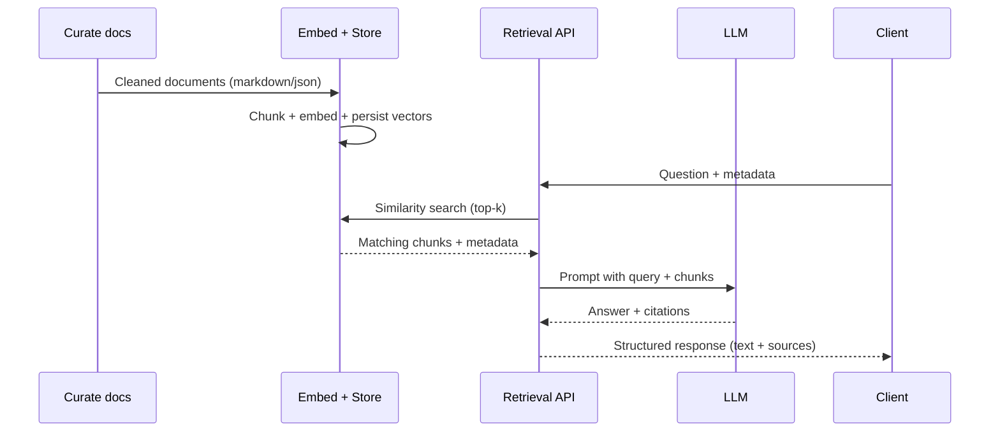

## Summary
Retrieval-augmented generation (RAG) keeps answers grounded in your latest content. This tutorial walks through curating a small document set, building an embeddings index, serving a retrieval-backed chat endpoint, and closing the loop with evaluations. You will leave with a working baseline that you can extend to hybrid retrieval, reranking, and production observability.

### You’ll learn
- How to curate and normalize source documents for RAG without dragging noise into prompts.
- How to chunk content, embed it with provider APIs, and load it into a lightweight vector store.
- How to build Node.js and Python retrieval services that fuse search results into prompts.
- How to measure relevance, groundedness, and latency with automated and human evaluations.
- How to evolve the stack with hybrid search, caching, and cost controls.

## Architecture at a glance



Use this architecture for internal knowledge bases, policy assistants, or support FAQs. Start with a simple stack so you understand where latency and quality issues come from before layering complex ranking logic.

## Step 0: Project setup

- **Directory layout**
  - `data/raw/` for original documents (PDF, HTML, Markdown).
  - `data/processed/` for cleaned Markdown/JSON.
  - `scripts/` for curation and embedding jobs.
  - `api/` for your retrieval service (Node.js or Python).
- **Dependencies**
  - Node.js 20+ and/or Python 3.11+
  - Vector store options: SQLite via `pgvector-lite`, `chromadb`, or provider-managed search (e.g., Azure Cognitive Search).
  - Provider SDKs (OpenAI, Anthropic, Cohere) for embeddings and responses.
- **Environment variables**
  - `OPENAI_API_KEY` (or provider equivalent)
  - `EMBEDDINGS_MODEL` (e.g., `text-embedding-3-large`)
  - `RESPONSES_MODEL` (e.g., `gpt-4o-mini`)

## Step 1: Curate and normalize documents

1. Export the highest-signal sources (product docs, policies, runbooks). Aim for 20–50 pages for your first iteration.
2. Convert to Markdown with consistent heading levels. Remove boilerplate (navigation menus, cookie banners) and collapse repeated content.
3. Capture metadata for each document:
   - `source_id`: stable identifier (URL slug or doc ID).
   - `title`: human-readable label.
   - `updated_at`: timestamp for freshness checks.
   - `tags`: optional product or audience labels.
4. Store the cleaned documents in `data/processed/` using a JSONL format for easy streaming.

```json
{"source_id":"kb-001","title":"Reset MFA","updated_at":"2025-02-01","body":"## Reset MFA\nSteps...","tags":["security"]}
{"source_id":"kb-002","title":"Rotate API keys","updated_at":"2025-01-20","body":"## Rotate API keys\n1. ...","tags":["platform"]}
```

Automate updates using nightly jobs that diff the source repository and regenerate the processed corpus.

## Step 2: Chunk and embed the corpus

Choose chunk sizes that balance context coverage with prompt budget. Start with 300-token windows and 60-token overlap. Keep chunk metadata so you can cite sources.

```ts
// scripts/embed.ts
import fs from "node:fs";
import path from "node:path";
import OpenAI from "openai";
import { createWriteStream } from "node:fs";
import { RecursiveCharacterTextSplitter } from "langchain/text_splitter";

const client = new OpenAI({ apiKey: process.env.OPENAI_API_KEY });
const splitter = new RecursiveCharacterTextSplitter({ chunkSize: 300, chunkOverlap: 60 });
const output = createWriteStream("data/embeddings.jsonl");

async function embed() {
  const files = fs.readdirSync("data/processed");
  for (const file of files) {
    const raw = fs.readFileSync(path.join("data/processed", file), "utf8");
    const doc = JSON.parse(raw) as { body: string; source_id: string; title: string; updated_at: string };
    const chunks = await splitter.splitText(doc.body);

    for (const [index, chunk] of chunks.entries()) {
      const embedding = await client.embeddings.create({
        model: process.env.EMBEDDINGS_MODEL ?? "text-embedding-3-large",
        input: chunk,
      });
      output.write(
        JSON.stringify({
          source_id: doc.source_id,
          title: doc.title,
          updated_at: doc.updated_at,
          chunk_index: index,
          text: chunk,
          embedding: embedding.data[0].embedding,
        }) + "\n",
      );
    }
  }
}

embed().then(() => output.end());
```

```python
# scripts/embed.py
import json
import os
from pathlib import Path

from openai import OpenAI
from langchain_text_splitters import RecursiveCharacterTextSplitter

client = OpenAI()
splitter = RecursiveCharacterTextSplitter(chunk_size=300, chunk_overlap=60)
output_path = Path("data/embeddings.jsonl")


def embed() -> None:
    with output_path.open("w", encoding="utf-8") as out_file:
        for file in Path("data/processed").glob("*.json"):
            doc = json.loads(file.read_text())
            chunks = splitter.split_text(doc["body"])
            for index, chunk in enumerate(chunks):
                embedding = client.embeddings.create(
                    model=os.environ.get("EMBEDDINGS_MODEL", "text-embedding-3-large"),
                    input=chunk,
                )
                record = {
                    "source_id": doc["source_id"],
                    "title": doc["title"],
                    "updated_at": doc["updated_at"],
                    "chunk_index": index,
                    "text": chunk,
                    "embedding": embedding.data[0].embedding,
                }
                out_file.write(json.dumps(record) + "\n")


if __name__ == "__main__":
    embed()
```

Load the embeddings into a vector store. For SQLite + `pgvector`, create a table with `vector(1536)` (for OpenAI’s 3-large). Index on `source_id` and `chunk_index` to support deduplication and freshness checks.

## Step 3: Serve a retrieval-backed endpoint

### Node.js (Express + Postgres `pgvector` example)

```ts
// api/server.ts
import express from "express";
import OpenAI from "openai";
import { Pool } from "pg";

const app = express();
app.use(express.json());

const pool = new Pool({ connectionString: process.env.DATABASE_URL });
const client = new OpenAI({ apiKey: process.env.OPENAI_API_KEY });

const embedModel = process.env.EMBEDDINGS_MODEL ?? "text-embedding-3-large";
const genModel = process.env.RESPONSES_MODEL ?? "gpt-4o-mini";

app.post("/rag", async (req, res) => {
  const { question, topK = 4 } = req.body;
  try {
    const queryEmbedding = await client.embeddings.create({ model: embedModel, input: question });
    const vector = queryEmbedding.data[0].embedding;
    const { rows } = await pool.query(
      `SELECT source_id, title, text, updated_at
       FROM chunks
       ORDER BY embedding <-> $1
       LIMIT $2`,
      [vector, topK],
    );

    const context = rows
      .map((row, idx) => `[[citation:${idx + 1}|${row.source_id}]] ${row.text}`)
      .join("\n\n");

    const response = await client.responses.create({
      model: genModel,
      input: [
        {
          role: "system",
          content:
            "You are a support analyst. Use only the provided context. Include citations in the format [citation:n].",
        },
        { role: "user", content: `Question: ${question}\n\nContext:\n${context}` },
      ],
      max_output_tokens: 500,
    });

    res.json({
      answer: response.output_text,
      sources: rows.map((row, idx) => ({
        id: row.source_id,
        title: row.title,
        citation: idx + 1,
        updated_at: row.updated_at,
      })),
    });
  } catch (error) {
    console.error(error);
    res.status(502).json({ error: "rag_failure" });
  }
});

app.listen(3000, () => console.log("RAG server listening on port 3000"));
```

### Python (FastAPI + Chroma example)

```python
# api/main.py
import os
import chromadb
from fastapi import FastAPI, HTTPException
from openai import OpenAI
from pydantic import BaseModel, Field

client = OpenAI()
chroma_client = chromadb.PersistentClient(path="data/chroma")
collection = chroma_client.get_or_create_collection("knowledge-base")

EMBED_MODEL = os.environ.get("EMBEDDINGS_MODEL", "text-embedding-3-large")
GEN_MODEL = os.environ.get("RESPONSES_MODEL", "gpt-4o-mini")


class RAGRequest(BaseModel):
    question: str
    top_k: int = Field(default=4, ge=1, le=10)


app = FastAPI()


@app.post("/rag")
async def rag_endpoint(payload: RAGRequest):
    try:
        query_embedding = client.embeddings.create(model=EMBED_MODEL, input=payload.question)
    except Exception as exc:  # noqa: BLE001
        raise HTTPException(status_code=502, detail="embedding_failed") from exc

    results = collection.query(query_embeddings=[query_embedding.data[0].embedding], n_results=payload.top_k)
    documents = results["documents"][0]
    metadatas = results["metadatas"][0]

    context = "\n\n".join(
        f"[citation:{idx + 1}|{metadata['source_id']}] {doc}"
        for idx, (doc, metadata) in enumerate(zip(documents, metadatas, strict=False))
    )

    try:
        completion = client.responses.create(
            model=GEN_MODEL,
            input=[
                {
                    "role": "system",
                    "content": "You answer with grounded facts, citing the provided documents using [citation:n] markers.",
                },
                {"role": "user", "content": f"Question: {payload.question}\n\nContext:\n{context}"},
            ],
            max_output_tokens=500,
        )
    except Exception as exc:  # noqa: BLE001
        raise HTTPException(status_code=502, detail="generation_failed") from exc

    return {
        "answer": completion.output_text,
        "sources": [
            {
                "id": metadata["source_id"],
                "title": metadata.get("title"),
                "citation": idx + 1,
                "updated_at": metadata.get("updated_at"),
            }
            for idx, metadata in enumerate(metadatas)
        ],
    }
```

Add rate limiting, request logging, and caching as described in `/docs/tutorials/cost-guardrails.md` when you move beyond prototypes.

## Step 4: Evaluate groundedness

Create a lightweight evaluation harness to ensure the model uses retrieved content correctly.

1. **Golden set:** Collect 30–50 question/answer pairs with known sources. Include tricky edge cases (ambiguous terms, outdated policies).
2. **Automated scoring:**
   - Use vector similarity between retrieved chunks and gold citations to flag missing sources.
   - Ask a judge model whether the answer is fully supported by the provided passages. Use `/docs/evaluations/grounded-qa-evals.md` as a template.
3. **Latency + cost tracking:** Record `embedding_ms`, `retrieval_ms`, `generation_ms`, and total tokens. Chart P50/P95 weekly.
4. **Human spot checks:** Sample 5 evaluations per week. Reviewers note hallucinations, citation quality, and missing context.

Automate the evaluation run using a scheduled GitHub Actions workflow or Airflow DAG that writes metrics to a dashboard.

## Step 5: Iterate and harden

- **Hybrid retrieval:** Combine dense search with BM25 reranking (see `/docs/patterns/rag/hybrid-ranking.md`) to improve recall on keyword-heavy queries.
- **Freshness checks:** Compare `updated_at` metadata to detection thresholds. If content is older than 90 days, flag the chunk for re-ingestion.
- **Prompt versioning:** Store prompts in Git and annotate releases with evaluation results. Roll back if groundedness drops below your threshold.
- **Cost optimization:** Cache embeddings for repeated queries, shorten chunk text with bullet summaries, and consider small-footprint models like GPT-4o mini for low-stakes answers.
- **Observability:** Emit trace spans for embedding, retrieval, and generation steps. Obfuscate user identifiers per `/docs/patterns/observability-context.md`.

## References

- OpenAI. “Embeddings API.” 2024. <https://platform.openai.com/docs/guides/embeddings>
- OpenAI. “Responses API.” 2024. <https://platform.openai.com/docs/guides/responses>
- Chroma. “Quickstart.” 2024. <https://docs.trychroma.com/getting-started>
- Meta AI. “Effective retrieval augmented generation.” 2024. <https://ai.facebook.com/blog/effective-retrieval-augmented-generation/>
- Microsoft. “Azure Cognitive Search vector search overview.” 2024. <https://learn.microsoft.com/azure/search/vector-search-overview>
