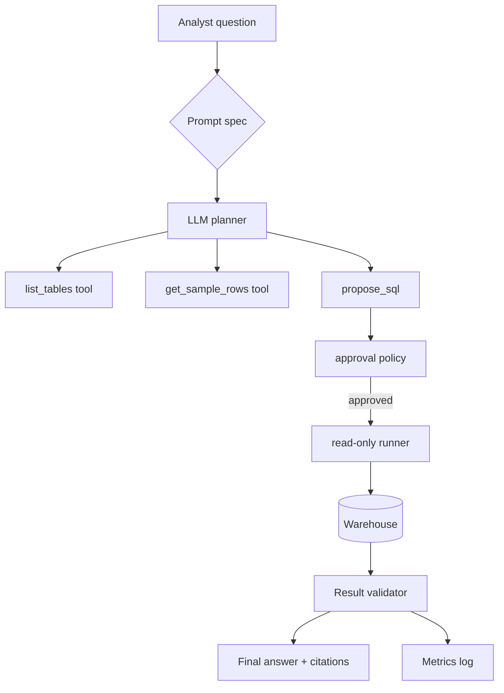

## Overview
This tutorial walks through building a safe, SQL-aware agent capable of answering analytical questions with approved data sources. You will combine schema introspection, guarded execution, and evaluation routines so the agent remains trustworthy and auditable.

## You’ll learn
- Model an agent prompt spec that keeps SQL within read-only boundaries.
- Connect schema retrieval and query execution tools in Python and Node.js.
- Implement approval workflows and guardrails for long-running or high-cost queries.
- Validate agent responses with assertions, sampling, and human spot checks.
- Monitor cost, latency, and accuracy over time using evaluation suites.

## Prerequisites
- Access to a warehouse (Snowflake, BigQuery, or PostgreSQL) with read-only credentials.
- Familiarity with SQL, dbt models, and LLM function calling.
- Python 3.10+ and Node.js 18+.
- An OpenAI or Azure OpenAI account for GPT-4.1 (or Claude 3 equivalent) with function calling enabled.

## System design snapshot



## Step 1 — Draft the agent prompt spec
Create a shared `prompts/sql-agent.md` file:

```markdown
## Intent
Answer analytical questions using read-only SQL against curated datasets.

## Inputs
- Natural language request.
- Allowed schemas and tables (list provided via tool call).
- Optional filters or metrics from the user.

## Outputs
- Final answer with summary, query snippets, and row-level caveats.
- SQL statements executed (max 3) with explanations.
- Observability notes: execution time, row count, cost estimate.

## Constraints
- Only run `SELECT` statements.
- Use `LIMIT` unless sample aggregation already reduces volume.
- Request human approval if query cost > $5 or runtime > 30s.

## Risks & mitigations
- Data leakage → enforce schema allowlist.
- Misinterpretation → require the agent to restate assumptions.
- Stale metrics → encourage `freshness` checks via dbt metadata.
```

## Step 2 — Implement tool surfaces
Provide a minimal Python toolkit to the LLM.

```python
# tools/sql_agent/tools.py
from __future__ import annotations
import os
from typing import Any
import time

import psycopg
from pydantic import BaseModel

DSN = os.environ["WAREHOUSE_DSN"]

class QueryResult(BaseModel):
    sql: str
    rows: list[dict[str, Any]]
    rowcount: int
    execution_ms: float


def list_tables(schema: str | None = None) -> list[str]:
    with psycopg.connect(DSN, autocommit=True) as conn:
        with conn.cursor() as cur:
            cur.execute(
                """
                select table_schema || '.' || table_name
                from information_schema.tables
                where table_type='BASE TABLE'
                order by 1
                """
            )
            return [row[0] for row in cur.fetchall()]


def run_query(sql: str) -> QueryResult:
    if "delete" in sql.lower() or "update" in sql.lower():
        raise ValueError("Only SELECT statements are permitted")
    with psycopg.connect(DSN, autocommit=True) as conn:
        with conn.cursor() as cur:
            cur.execute("set statement_timeout = 20000")
            started = time.perf_counter()
            cur.execute(sql)
            elapsed = (time.perf_counter() - started) * 1000
            columns = [desc.name for desc in cur.description]
            rows = [dict(zip(columns, row)) for row in cur.fetchmany(2000)]
            return QueryResult(
                sql=sql,
                rows=rows,
                rowcount=cur.rowcount,
                execution_ms=elapsed,
            )
```

In Node.js, add a guard that routes through a policy engine before execution.

```ts
// tools/sql-agent/index.ts
import { config } from "dotenv";
import { OpenAI } from "openai";
import { z } from "zod";
import { readFile } from "node:fs/promises";
import { execFile } from "node:child_process";
import { promisify } from "node:util";

config();
const run = promisify(execFile);
const client = new OpenAI({ apiKey: process.env.OPENAI_API_KEY });

const QueryPlan = z.object({
  question: z.string(),
  sql: z.array(z.string().regex(/^select/i)).max(3),
  approvals: z.array(z.string())
});

export async function answer(question: string) {
  const systemPrompt = await readFile("prompts/sql-agent-system.txt", "utf-8");
  const response = await client.responses.create({
    model: "gpt-4.1",
    input: [
      { role: "system", content: systemPrompt },
      { role: "user", content: question }
    ],
    tools: [
      { type: "function", function: { name: "list_tables", parameters: { type: "object", properties: {} } } },
      { type: "function", function: { name: "run_query", parameters: { type: "object", properties: { sql: { type: "string" } }, required: ["sql"] } } }
    ],
    response_format: { type: "json_object" }
  });

  const plan = QueryPlan.parse(JSON.parse(response.output_text));
  if (plan.approvals.length) {
    throw new Error(`Human approval required: ${plan.approvals.join(", ")}`);
  }
  const executions = await Promise.all(
    plan.sql.map(async statement => {
      const { stdout } = await run("python", ["tools/sql_agent/run_query.py", statement]);
      return JSON.parse(stdout);
    })
  );
  return { plan, executions };
}
```

## Step 3 — Wire approval policies
- Define thresholds in code: reject cross-join hints or `select *` on wide tables.
- Require multi-factor approval (Slack + PR comment) when cost heuristics exceed budget.
- Log denied queries and prompt adjustments for weekly tuning.

## Step 4 — Validate outputs
1. Parse agent responses into Pydantic models and assert schema alignment.
2. Sample 10 rows from each result set and compare against historical aggregates.
3. Flag anomalies using dbt exposures or `dbt source freshness` metadata.
4. Document findings in the final message so consumers know limitations.

## Step 5 — Build an evaluation suite
- Curate 20 canonical analytics questions with expected SQL and answers.
- Store them in `evals/sql-agent.jsonl` with fields `{question, expected_sql, expected_dimensions}`.
- Run nightly regression tests:
  ```bash
  pytest tests/test_sql_agent_regressions.py -m nightly
  ```
- Track accuracy (exact SQL match), semantic correctness (compare aggregates), and latency.
- Add alerts when accuracy drops below 80% or latency exceeds 8 seconds.

## Step 6 — Monitor in production
- Emit structured logs with request IDs, cost, and response tokens.
- Forward metrics to your observability stack (e.g., OpenTelemetry + Grafana).
- Review misfires weekly and adjust prompt or tool limits.

## Try it locally
1. Set `WAREHOUSE_DSN` to a read-only database user.
2. Run `node tools/sql-agent/demo.js "What were signups by plan last week?"`.
3. Approve or deny proposed SQL when prompted.
4. Inspect logs at `logs/sql-agent.jsonl` to monitor execution history.

## References
- OpenAI. “Function calling.” https://platform.openai.com/docs/guides/function-calling. Accessed 6 June 2024.
- Snowflake. “Access control overview.” https://docs.snowflake.com/en/user-guide/security-access-control-overview. Accessed 6 June 2024.
- dbt Labs. “Source freshness.” https://docs.getdbt.com/docs/build/sources#freshness. Accessed 6 June 2024.
